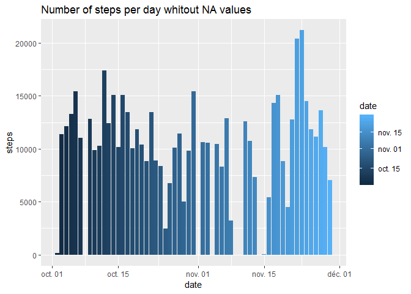
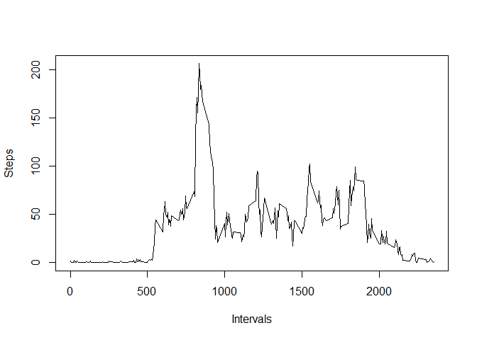
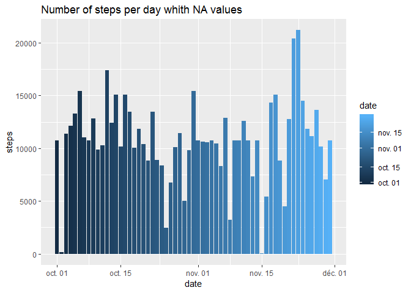
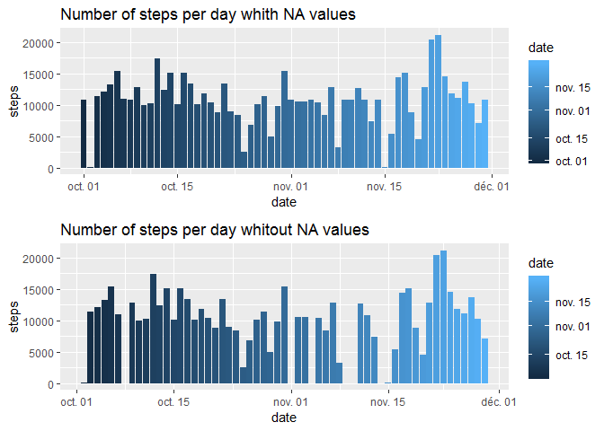

##Loading and preprocessing the data
###Show any code that is needed to


1. Load the data (i.e. read.csv())


```r
library(sqldf)
library(ggplot2)
library(lattice)
URL <- "https://d396qusza40orc.cloudfront.net/repdata%2Fdata%2Factivity.zip"
download.file(URL,"ACTIVITY_MONIT_DATA.zip",mode="wb")
unzip("ACTIVITY_MONIT_DATA.zip")
STEPS <- read.csv(file="activity.csv", header=TRUE, sep=',' , na.strings = "NA")
```


2. Process/transform the data (if necessary) into a format suitable for your analysis


```r
STEPS$date <- as.Date(STEPS$date, format="%Y-%m-%d")
```


##What is mean total number of steps taken per day?
###For this part of the assignment, you can ignore the missing values in the dataset.


1. Calculate the total number of steps taken per day


```r
THEDF <- na.omit(STEPS)
mean(THEDF$steps)
```

```
## [1] 37.3826
```


2. If you do not understand the difference between a histogram and a barplot, research the difference between them. 
   **Make a histogram of the total number of steps taken each day**
   

```r
ggplot(THEDF, aes(x=date, y=steps, group=date)) + geom_bar(stat = "identity",aes(fill=date)) + ggtitle("Number of steps per day whitout NA values")
```

<!-- -->


3. Calculate and report the mean and median of the total number of steps taken per day


```r
#----------------------------------
MMDFAVG <- aggregate(THEDF$steps,list(gp=THEDF$date),mean)
names(MMDFAVG) <- c("date","Mean")
MMDFMED <- aggregate(THEDF$steps,list(gp=THEDF$date),median)
names(MMDFMED) <- c("date","Median")
MMDF <- sqldf("select t.date, t.Mean, u.Median from MMDFAVG t left outer join MMDFMED u on u.date=t.date")
#----------------------------------
library(gridExtra)
P1 <- ggplot(MMDF, aes(x=date, y=Mean, group=date)) + geom_bar(stat = "identity",aes(fill=date)) + ggtitle("Mean of steps taken each day")
P2 <- ggplot(MMDF, aes(x=date, y=Median, group=date)) + geom_point(stat = "identity",aes(fill=date)) + ggtitle("Median of steps taken each day")
grid.arrange(P1, P2, ncol=1)
```

<!-- -->


##What is the average daily activity pattern?


1. Make a time series plot (i.e. type = "l") of the 5-minute interval (x-axis) 
   and the average number of steps taken, averaged across all days (y-axis)


```r
THEDFAVG <- sqldf("select avg(steps) as Mean_steps, interval from THEDF group by interval")
plot(THEDFAVG$interval, round(THEDFAVG$Mean_steps,2), type="l", lwd = "1", xlab="Intervals", ylab="Steps")
```

<!-- -->


2. Which 5-minute interval, on average across all the days in the dataset, contains the maximum number of steps?


```r
THEDFAVG[which.max(THEDFAVG$Mean_steps),]$interval
```

```
## [1] 835
```

##Imputing missing values
###Note that there are a number of days/intervals where there are missing values (coded as NA).
###The presence of missing days may introduce bias into some calculations or summaries of the data.


1.Calculate and report the total number of missing values in the dataset (i.e. the total number of rows with NAs)


```r
nrow(STEPS[is.na(STEPS$steps),])
```

```
## [1] 2304
```


2. Devise a strategy for filling in all of the missing values in the dataset. The strategy does not need to be 
sophisticated. 

   - For example, you could use the mean/median for that day, or the mean for that 5-minute interval, etc.


```r
NASTEPS <- STEPS[is.na(STEPS$steps),]
THEDFAVGNONNA <- sqldf("select round(avg(steps)) as Mean_steps, interval from THEDF group by interval")
FILLED_NASTEPS <- sqldf("select u.Mean_steps as steps, t.date, t.interval from NASTEPS t left outer join THEDFAVGNONNA u on u.interval=t.interval")
```


3. Create a new dataset that is equal to the original dataset but with the missing data filled in.


```r
FILLEDSTEPS <- rbind(THEDF, FILLED_NASTEPS)
DIM_init <- noquote(paste0("Dimension of the initial STEPS DF :"," [",dim(STEPS)[1],":",dim(STEPS)[2],"]"))
NA_init <- noquote(paste0("Number of NA steps in the initial STEPS DF: ",nrow(STEPS[is.na(STEPS$steps),])))
DIM_NAFS <- noquote(paste0("Dimension of the filled STEPS DF :"," [",dim(FILLEDSTEPS)[1],":",dim(FILLEDSTEPS)[2],"]"))
NA_FS <- noquote(paste0("Number of NA steps in the filled STEPS DF: ",nrow(FILLEDSTEPS[is.na(FILLEDSTEPS$steps),])))
writeLines(paste0(DIM_init," -- ",NA_init,".\n",DIM_NAFS,"  -- ",NA_FS,"."))
```

```
## Dimension of the initial STEPS DF : [17568:3] -- Number of NA steps in the initial STEPS DF: 2304.
## Dimension of the filled STEPS DF : [17568:3]  -- Number of NA steps in the filled STEPS DF: 0.
```


4. Make a histogram of the total number of steps taken each day and Calculate and report the mean and median total number of steps taken per day. 


```r
ggplot(FILLEDSTEPS, aes(x=date, y=steps, group=date)) + geom_bar(stat = "identity",aes(fill=date)) + ggtitle("Number of steps per day whith NA values")
```

<!-- -->

- Do these values differ from the estimates from the first part of the assignment? 


```r
P1 <- ggplot(FILLEDSTEPS, aes(x=date, y=steps, date)) + geom_bar(stat = "identity",aes(fill=date)) + ggtitle("Number of steps per day whith NA values")
P2 <- ggplot(THEDF, aes(x=date, y=steps, group=date)) + geom_bar(stat = "identity",aes(fill=date)) + ggtitle("Number of steps per day whitout NA values")
grid.arrange(P1, P2, ncol=1)
```

<!-- -->

- What is the impact of imputing missing data on the estimates of the total daily number of steps?


```r
NAIMPACT <- sqldf("select * from FILLEDSTEPS except select * from THEDF")
names(NAIMPACT) <- c("NA_Step_Impact", "date", "interval")
ggplot(NAIMPACT, aes(x=date, NA_Step_Impact, date)) + geom_bar(stat = "identity",aes(fill=date)) + ggtitle("NA values fullfilling impact on steps per day")
```

<!-- -->


##Are there differences in activity patterns between weekdays and weekends?
###For this part the weekdays() function may be of some help here. 
**Use the dataset with the filled-in missing values for this part.**


1. Create a new factor variable in the dataset with two levels - "weekday" and "weekend" indicating whether a given date is a weekday or weekend day.


```r
FILLEDSTEPS$Daytype <- factor((as.POSIXlt(FILLEDSTEPS$date)$wday %in% c("0","6")),labels=c("weekday", "weekend"))
```


2. Make a panel plot containing a time series plot (i.e. type="l") of the 5-minute interval (x-axis) and the average number of steps taken, averaged across all weekday days or weekend days (y-axis). 
   **See the README file in the GitHub repository to see an example of what this plot should look like using simulated data.**


```r
AVGFS <- aggregate(FILLEDSTEPS$steps,list(interval=FILLEDSTEPS$interval, Daytype=FILLEDSTEPS$Daytype),mean)
names(AVGFS) <- c("interval", "Daytype", "Mean_steps")
xyplot(Mean_steps~interval | Daytype, data=AVGFS, layout=c(1,2), type="l", lwd = "1", xlab="Interval", ylab="Number of steps")
```

<!-- -->
